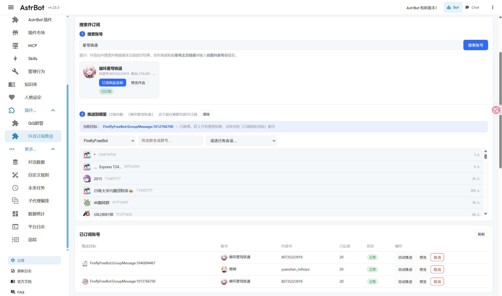

<div align="center">

[](https://github.com/AstrBotDevs/AstrBot)


[](LICENSE)

# 抖音订阅推送

订阅抖音账号，TA 发布新作品时自动推送——图文发图片，视频发视频。

[](https://cloud.astrbot.app/plugin/XingYunStar/astrbot_plugin_douyin_subscribe)

</div>

---

## 📖 简介

面向 **aiocqhttp（OneBot v11）** 平台，把抖音账号变成可以订阅的推送源：

- 在 **WebUI 里搜索抖音账号**一键订阅，选好机器人和群号即可绑定推送目标；
- 账号发布新作品时自动推送到该会话，**图文作品发图片、视频作品发视频**；
- 附带作者 / 简介 / 发布时间 / 作品链接四项可选信息，**默认全部关闭**，即默认只发作品本体；
- 视频超过体积上限时自动降级为发送链接，避免动辄几百 MB 的文件占用带宽。

**签名完全由纯 Python 实现**——不需要 Node.js，不携带任何第三方 JS，
`x-secsdk-web-signature` 由标准库 `hashlib` 算出来。

## ✨ 功能特性

- 🔐 **纯 Python 签名**：抖音对 `/aweme/v1/web/aweme/post/` 一类接口要求 `x-secsdk-web-signature`，
  它实际上是一个纯函数 `md5(f"{uifid}_{timestamp}_{SALT}_{query}")`，不依赖会话密钥或握手，
  因此可以脱离字节的 securitySDK 直接用标准库算出来。**不装 Node、不带第三方 JS、无版权风险。**
- 🎯 **智能投递**：实测发现**公开作品**的视频直链不带 Cookie 也能下载，**「仅自己可见」的作品**则一律 403，
  所以按可见性二选一——公开走直链省流量，私密由插件带 Cookie 下载后经 AstrBot 文件服务托管。
  直链投递失败时还会自动改用下载重试一次。
- 🖼️ **图文 / 视频自动分流**：识别 `images` 字段，图文发全部图片，视频发视频。
  抖音图文下发的是 WebP，QQ 侧支持不完整会报 `highway upload error 921`，插件本地化时统一转成 JPEG。
- 📏 **体积上限与降级**：超过上限（默认 100MB）不再上传本体，改为发送链接，可选附带封面。
  **视频发送与群文件发送共用同一个上限**，群文件是与视频并列的投递方式、不是超限兜底。
- 🖥️ **WebUI 管理页**：搜索账号一键订阅、**选择机器人后自动拉取群列表**（带头像，点群名即生成推送目标）、
  **按配置实时预览推送效果**、发送测试推送、在线改配置（改动即时生效，无需点保存）。
- 🔗 **多群连订**：点过一次「订阅到此目标」后会记住该账号，之后**点任意群名都会自动订阅**，
  一次搜索就能连续订阅多个群；重复点同一个群会提示已订阅且不发多余请求。
- 🔄 **自适应轮询**：账号越多间隔越长并叠加随机抖动；连续失败按指数退避，成功一次立即恢复。
- 🤫 **静默首次同步**：订阅时记录历史作品作为去重基线，只推新作品，不会刷屏。
  需要立刻确认订阅是否生效时，可开启「推送最近作品」——只推**最近一条**，
  且带**时间范围**（默认 12 小时），避免订阅一个久未更新的账号时把几个月前的老作品当新作品推出来。
  该开关**对已有订阅同样生效**：把本来关着的开关打开，下一轮检查就会给每个已订阅账号
  各补推一次最近作品（每个账号只补一次，不会因为反复开关而重复推送）。
- 🧯 **三级兜底**：直链投递失败 → 下载后重试 → 仍失败才降级为「文本 + 链接 + 封面」，
  保证订阅者至少能收到通知。

## 🖼️ 界面预览

<div align="center">



<sub>WebUI 管理页：搜索账号 → 选机器人自动拉群列表 → 点群名订阅；②③ 区块常驻显示当前订阅对象</sub>

</div>

## 📦 安装

1. 把 `astrbot_plugin_douyin_subscribe` 目录放进 AstrBot 的 `data/plugins/` 下；
2. 在 WebUI 的**插件管理**里启用（或重启 AstrBot）；
3. 进入**插件配置**填入抖音 Cookie —— **这一步是必填的，填完就能用了**；
4. 打开插件页 `douyin_subscribe`，选机器人 → 点群名 → 搜索账号订阅。

> [!TIP]
> 除 Cookie 外**不需要配置任何东西**。`callback_api_base` 这个全局项**大多数情况下也不用填**，
> 只有在订阅了「仅自己可见」的作品、或想让超限大视频也发本体时才需要，详见[下一节](#callback-base)。

| 项 | 要求 |
| --- | --- |
| AstrBot | `>= 4.25`（用到插件 Pages 与 `context.register_web_api`） |
| 平台 | `aiocqhttp`（OneBot v11）；其它平台不保证可用 |
| 依赖 | 无第三方依赖，`requirements.txt` 不含签名库 |
| Python | 3.10+ |
| 开发与实测环境 | AstrBot **4.25.5** + [SnowLuma](https://github.com/SnowLuma/SnowLuma) |

## ⚙️ 配置

### 1. 抖音 Cookie（必填）

1. 浏览器登录 <https://www.douyin.com>；
2. `F12` → `Network` → 任意请求 → 复制完整的 `Cookie` 请求头；
3. 粘贴到 **WebUI 页面顶部的「抖音 Cookie」卡片**（多行文本框，粘贴后点「保存并验证」）。

   > [!TIP]
   > 也可以填在 AstrBot 的**插件配置**里，两边都能用。WebUI 那个入口更适合长 Cookie：
   > 所见即所得，而且**保存后会当场打一次接口验证**——有效期、登录账号立刻告诉你，
   > 不用等下一次轮询失败才发现填错了。

签名所需的 `uifid` 会自动从 Cookie 的 `UIFID` 字段提取。**不需要导出浏览器密钥，也不需要装 Node.js。**

<a id="callback-base"></a>

### 2. `callback_api_base`（大多数情况下**不用填**）

这是 AstrBot 的**全局**配置项，不是本插件的配置。**默认留空即可**，只有下面这几种情况才需要填：

| 情况 | 要不要填 |
| --- | --- |
| 订阅的账号都是**公开发布**作品 | ❌ 不用 |
| 订阅自己的账号，作品设了**「仅自己可见」** | ✅ 要 |
| 想让**超过体积上限的大视频**也发本体，而不是降级成链接 | ✅ 要 |
| 推送日志里出现视频下载失败（403 / `retcode 100`） | ✅ 要 |

**留空时不会报错**：公开作品走直链依然正常；一旦遇到需要本地化的作品，插件会自动**降级为发链接**，
并在推送日志和 WebUI 预览里给出提示——只是收不到视频本体而已。

#### 它是什么

AstrBot 内置一个**文件服务**。插件要把文件交给消息平台时，先把文件注册进去拿到一个 token，
AstrBot 再拼出下载链接 `{callback_api_base}/api/file/{token}` 给平台去拉。

问题在于 AstrBot **无法自动判断「外部该用什么地址访问我」**——可能是容器名、宿主机 IP、也可能是反代域名，
所以只能由你显式告诉它。该路由**免鉴权**，token 本身就是凭证，机器人无需账号即可下载。

#### 为什么本插件会用到它

抖音视频 CDN 有防盗链，且「仅自己可见」的作品直链必须带 Cookie：

| 做法 | 结果 |
| --- | --- |
| 插件把抖音直链交给平台，让平台自己下载 | ❌ 平台没有 Cookie → **403** → 平台把错误页当视频上传 → QQ 报 `highway upload error 921` |
| 插件带 Cookie 下载到本地 → 交给文件服务 → 平台从 AstrBot 拉取 | ✅ 平台完全不接触抖音 CDN，绕开防盗链 |

#### 填在哪、填什么

**AstrBot WebUI → 配置 → 系统配置 → 找到「对外可达的回调接口地址」**
（与「时区」「http_proxy」「pip 安装参数」同一个分组）

填一个**消息平台所在容器能访问到的地址**，带上 AstrBot 的 dashboard 端口（默认 `6185`）：

| 部署方式 | 填什么 |
| --- | --- |
| 机器人与 AstrBot 在**同一 docker 网络** | `http://astrbot:6185`（用 AstrBot 的容器名） |
| 跨网络 / 想更通用 | `http://<宿主机内网IP>:6185`，如 `http://192.168.1.10:6185` |
| 有反向代理和域名 | `https://bot.example.com`（**不要带尾斜杠**） |

> [!WARNING]
> **不要填 `http://localhost:6185`**——除非机器人与 AstrBot 在同一个容器里，
> 否则 `localhost` 在机器人容器里指向它自己，文件永远拉不到。

#### 怎么验证填对了

**方法一：从机器人容器 curl 一下**，返回 `200` 即通：

```bash
docker exec <机器人容器名> curl -s -o /dev/null -w "%{http_code}\n" http://astrbot:6185/
```

> [!IMPORTANT]
> 这一招的**前提是机器人容器与 AstrBot 容器在同一个 docker 网络**——否则 `astrbot` 这个容器名
> 在机器人容器里根本解析不了。先确认两者有没有**共有网络**：

```bash
# 分别查看两个容器各在哪些网络，有交集就能直接用容器名互访
docker inspect <AstrBot容器名> --format '{{range $k,$v := .NetworkSettings.Networks}}{{$k}} {{end}}'
docker inspect <机器人容器名>  --format '{{range $k,$v := .NetworkSettings.Networks}}{{$k}} {{end}}'
```

实测本机输出（两者共有 `bot` 与 `bridge`，所以容器名可以直接互访）：

```text
astrbot    网络: TRSS_2 bot bridge
snowluma   网络: bot bridge
```

**如果没有共有网络**，把机器人接到 AstrBot 所在的网络上（立即生效、无需重启，重启后仍保留）：

```bash
docker network connect <AstrBot所在的网络名> <机器人容器名>
```

连上后再 curl 一次确认，通过就用容器名填 `callback_api_base`：`http://astrbot:6185`

**不想动网络的话**，也可以改用宿主机 IP，彻底跳过容器名解析：

```bash
docker exec <机器人容器名> curl -s -o /dev/null -w "%{http_code}\n" http://<宿主机内网IP>:6185/
```

此时 `callback_api_base` 也要相应填 `http://<宿主机内网IP>:6185`。

**方法二**：在 WebUI 里对一个「仅自己可见」的作品点「预览作品」，看预览区提示——
显示 `该作品为「仅自己可见」…已改为本地化投递` = 可用；显示 `未配置 callback_api_base` = 还没配好。

**方法三**：在「已订阅账号」里点「测试推送」，去群里看视频能否正常播放。

### 3. 插件配置项

| 分组 | 项 | 默认 | 说明 |
| --- | --- | --- | --- |
| — | 抖音 Cookie | 空 | 必填，等同于登录态，请勿分享 |
| — | 启用轮询 | 开 | 关闭后停止后台轮询，订阅关系保留 |
| 推送内容 | 1. 作者 | 关 | 附加「📱【作者】发布了新视频」 |
| 推送内容 | 2. 简介 | 关 | 附加作品文案，超出字数自动截断 |
| 推送内容 | 3. 发布时间 | 关 | 附加发布时间 |
| 推送内容 | 4. 作品链接 | 关 | 附加作品链接 |
| 推送内容 | 超限时的链接形态 | 资源直链 | `resource` 资源直链 / `page` 作品网页 |
| 推送内容 | 群聊 @全体成员 | 关 | 仅群聊生效 |
| 视频推送 | 发送方式 | 视频发送 | `video` 视频发送 / `file` 群文件发送（并列二选一） |
| 视频推送 | 大小上限 (MB) | 100 | **对两种发送方式同样生效**；0 表示不限制 |
| 视频推送 | 超限时附带封面 | 开 | 降级为链接时补一张封面 |
| 视频推送 | 视频投递 | 自动 | `auto` 公开走直链·私密先下载 / `direct` 始终直链 / `download` 始终先下载 |
| 视频推送 | 改用 snssdk 播放接口 | 关 | 默认用 `play_addr` 直链；开启后改用会 302 跳转的播放接口 |
| 轮询策略 | 基础间隔 (s) | 300 | 抖音有风控，不建议低于 300 |
| 轮询策略 | 抖动 (s) | 30 | 叠加 0~N 秒随机值，避免同秒集中请求 |
| 轮询策略 | 账号多时自动拉长间隔 | 开 | 实际间隔 = 基础 × 账号数 ÷ 并发 |
| 轮询策略 | 单轮最大等待 (s) | 1800 | 自适应间隔的上限 |
| 轮询策略 | 单轮并发数 | 2 | 不建议超过 3 |
| 轮询策略 | 出错退避上限 (s) | 1800 | 连续失败按指数退避，成功即恢复 |
| 订阅行为 | 推送最近作品（订阅时 / 打开开关时） | 关 | 订阅时先推**最近一条**作品便于确认生效；**打开这个开关也会给已订阅账号各补推一次**（每账号仅一次） |
| 订阅行为 | 首次推送的时间范围 (h) | 12 | 最近那条作品需发布于 N 小时内才推；0 表示不限 |
| 订阅行为 | 单次检查最多推送条数 | 3 | 防止长时间停机后恢复刷屏 |
| 订阅行为 | 每个会话订阅上限 | 20 | 0 表示不限制 |
| 订阅行为 | 仅管理员可订阅 | 开 | 开启后普通群成员只能用查询类命令 |
| 高级 | 调试日志 | 关 | 输出签名、耗时、响应长度等细节 |

### 4. ⚠️ 关于资源直链的风险

`resource` 形态发的是抖音 CDN 的**会话级签名地址**，需要注意：

| 情况 | 直链能否打开 |
| --- | --- |
| **公开作品** | ✅ 可以，也能分享；但**带有效期**，推送发出几小时后基本失效 |
| **「仅自己可见」的作品** | ❌ 一律 403，也无法分享 |

想让链接长期可打开，把「超限时的链接形态」改成**作品网页**。

想让视频**不降级、直接发本体**，有两条路：把「大小上限」调大（视频小于上限时本就会发本体），
或按[上一节](#callback-base)配置 `callback_api_base`（这样「仅自己可见」的作品也能发本体）。

## 💻 使用说明

### 群聊命令

| 命令 | 别名 | 说明 |
| --- | --- | --- |
| `/抖音订阅 <主页链接 或 抖音号>` | `dy订阅`、`订阅抖音` | 订阅账号 |
| `/抖音取消 <关键词>` / `/抖音取消 all` | `dy取消`、`取消抖音` | 取消订阅 |
| `/抖音列表` | `dy列表`、`订阅列表` | 查看本会话订阅 |
| `/抖音查询 [关键词]` | `dy查询` | 立即查看某账号最新作品 |
| `/抖音状态` | `dy状态` | Cookie 有效性、订阅数、间隔、错误统计 |

推荐直接粘贴**账号主页链接**（`https://www.douyin.com/user/MS4wLjABAAAA...`），成功率最高。

### WebUI 管理页

进入 **插件管理 → 抖音订阅推送 → 打开 `douyin_subscribe` 页面**：

| 区块 | 能做什么 |
| --- | --- |
| 抖音 Cookie | 页面**最顶部**。多行文本框粘贴完整 Cookie，点「保存并验证」会立刻探测有效性并显示登录账号 |
| ① 搜索账号 | 输入昵称 / 抖音号 / 主页链接搜索，结果卡片带头像；点「订阅到此目标」或「预览作品」 |
| ② 推送到哪里 | 选机器人 → **自动拉取群列表（带头像）** → 点群名生成推送目标；或直接选已有会话 |
| 已订阅账号 | 查看全部订阅（含会话头像、账号头像、已记录条数、失败次数），可测试推送 / 预览 / 取消 |
| 推送内容配置 | 四项附加信息 + 视频 + 轮询 + 订阅行为，**改动即时生效无需保存** |
| 推送效果实时预览 | 按上方配置渲染「群里最终会收到什么」，逐项带对应底色 |
| 运行状态 | 登录账号（带头像）、订阅数、当前间隔、累计推送/检查/错误数 |

## 🧠 实现原理

### 签名

抖音的 `/aweme/v1/web/aweme/post/` 等接口要求 `x-secsdk-web-signature`。该签名是一个纯函数：

```python
query = urllib.parse.urlencode(除签名外的全部参数)
sig   = hashlib.md5(f"{uifid}_{timestamp}_{SALT}_{query}".encode()).hexdigest()
```

`SALT` 是 securitySDK 打包文件里的字符串常量（douyin_web 用 project-id=34）。
它不依赖会话密钥或握手，所以纯 Python 就能算出来，**无需 Node.js 补环境，也无需从浏览器导出任何密钥**。

### 消息组装

- **视频 / 群文件段必须单独成条**，否则 OneBot 返回 `retcode 1400`，由 `split_chain()` 拆分；
- **所有文本合并进同一个 Plain 段**，避免多段 Plain 被平台拼接时挤成一坨；
- 平台拒绝媒体时自动降级为「文本 + 链接 + 封面」。

## ⚠️ 已知限制与排查

### 踩过的坑（都已在代码里规避）

| # | 现象 | 原因 |
| --- | --- | --- |
| 1 | 列表返回 200 但 `aweme_list` 为空 | 作品列表接口**不能带 `publish_video_strategy_type`** |
| 2 | `status_code: 8 用户未登录` | 缺 `aid=6383` |
| 3 | 看着成功却没数据 | 风控会返回 `200 + status_code:0 + 空内容`，**判定必须以「是否真拿到数据」为准** |
| 4 | 抖音号搜不到 | 站内搜索对高频请求返回空甚至 `status_msg:"blocked"`，已改用 `iesdouyin` 用户信息接口优先解析 |
| 5 | 视频直链 403 | 「仅自己可见」的作品直链必须带 Cookie；公开作品不需要 |
| 6 | 图床全部 403 | 抖音图床在 **TLS 指纹层面拒绝 aiohttp**（同 URL 同请求头 aiohttp 403、requests 200），已自动回退 requests |
| 7 | QQ 报 `highway upload error 921` | 图文是 WebP，QQ 不支持，已本地化转 JPEG |
| 8 | 体积探测总失败 | 抖音 CDN **不支持 HEAD**，必须 `GET + Range` |
| 9 | `retcode 1400 message element "video" must be the only segment` | 视频段必须单独成条 |
| 10 | 消息里文字挤成一坨 | 多段 Plain 拼接不补换行，已合并为单段 |
| 11 | WebUI 里头像/预览视频加载不出来 | AstrBot 会在服务端**重写整份插件页 HTML 里所有 `src`/`href`**（连 `<script>` 内部一起匹配），动态地址必须以 `data-url` 承载、插入 DOM 后再回填 |

### 失效时的排查顺序

如果某天所有请求都返回 403（`Sign Invalid` / `Signature Not Found`）：

1. 先用 `/抖音状态` 确认 Cookie 是否仍然有效；
2. 若 Cookie 正常，大概率是 `SIGN_SALT` 变了——这是**一个常量**，从新版 `runtime_bundler_*.js` 里
   重新提取即可，**不需要重新逆向算法**；
3. 若签名能过但列表为空，检查是否有参数语义变化（参考上表第 1 条）；
4. 若视频推送突然全失败，先查 `callback_api_base` 是否仍可被平台容器访问。

## 📂 目录结构

```text
astrbot_plugin_douyin_subscribe/
├── main.py                        # 插件入口：命令、自适应轮询调度、推送与降级
├── douyin_api.py                  # 纯 Python 签名 + 请求 + 解析 + 下载
├── pusher.py                      # 消息链组装、体积判定、图片转码、消息段拆分
├── store.py                       # 订阅关系与去重基线持久化（原子写入）
├── webapi.py                      # WebUI 后端接口 + 头像服务端取回
├── _conf_schema.json              # 插件配置定义
├── metadata.yaml                  # 插件元信息
├── requirements.txt               # 无第三方依赖
├── pages/douyin_subscribe/        # WebUI 页面（单文件内联）
└── .github/img/webui.png          # README 效果图
```

运行期数据写入 `data/plugin_data/astrbot_plugin_douyin_subscribe/`：
`subscriptions.json` 保存订阅与去重状态，`media_tmp/` 存放待投递的临时媒体（自动清理）。

## 🛡️ 合规提示

本插件通过抖音网页端接口读取公开数据。请仅用于**个人学习与自建实例**，
遵守目标平台的服务条款，控制轮询频率，不要用于批量抓取或商业用途。

## 📄 许可证

本项目基于 [MIT License](LICENSE) 开源。
